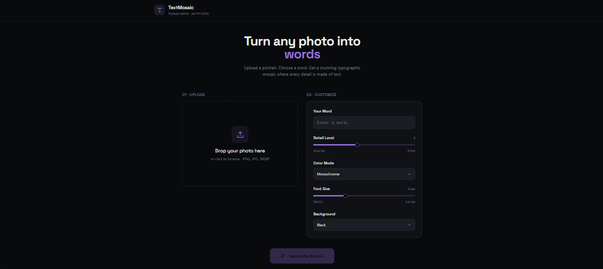

# TextMosaic — Typographic Portrait Generator

> Turn any photo into a stunning mosaic made entirely of words.



## ✨ Features

- 📸 **Image Upload** — Drag & drop or click to browse (PNG, JPG, WEBP)
- 🔤 **Custom Word** — Any word or phrase becomes the building block of the portrait
- 🎚️ **Detail Level** — Control text grid density from coarse to ultra-fine
- 🎨 **Color Modes** — Monochrome · Full Color · Duotone · Neon Glow
- 📐 **Font Size Control** — Small to large with brightness-adaptive scaling
- 🌃 **Background Options** — Black · White · Dark Purple
- ⚡ **Live Progress** — Animated progress bar during rendering
- 💾 **Download PNG** — Export your full-resolution typographic portrait

## 🖼️ How It Works

1. **Upload** any portrait or image
2. **Enter a word** — it will be repeated to form the entire image
3. **Customize** detail level, color mode, font size, and background
4. **Generate** — the canvas renderer samples pixel brightness to place words with varying size, opacity, and rotation
5. **Download** your high-resolution typographic mosaic

## 🚀 Getting Started

```bash
# Install dependencies
npm install

# Start development server
npm run dev

# Build for production
npm run build
```

Then open [http://localhost:5173](http://localhost:5173) in your browser.

## 🛠️ Tech Stack

- **React** + **Vite**
- **HTML Canvas API** — pixel-perfect brightness sampling
- **Vanilla CSS** — premium dark theme with glassmorphism
- **Google Fonts** — Inter typeface

## 📁 Project Structure

```
src/
  App.jsx       # Main app component & mosaic generation logic
  App.css       # Premium dark UI styling
  index.css     # Global reset & scrollbar
public/
  homepage-base-picture.png   # Reference portrait image
```

## 🧠 Mosaic Algorithm

The generator:
- Samples each pixel's **brightness** from the source image
- Maps brightness → **font size**, **opacity**, and **text color** per word
- Applies subtle **rotation variance** (±8°) for an organic look
- Uses **darker density** in shadowed areas and **lighter spacing** in highlights
- Renders in async batches to keep the UI responsive

## 📄 License

MIT
